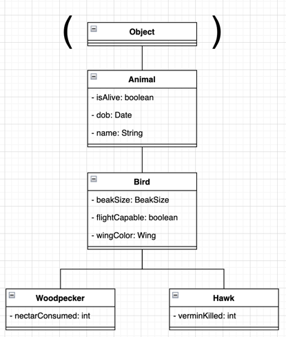
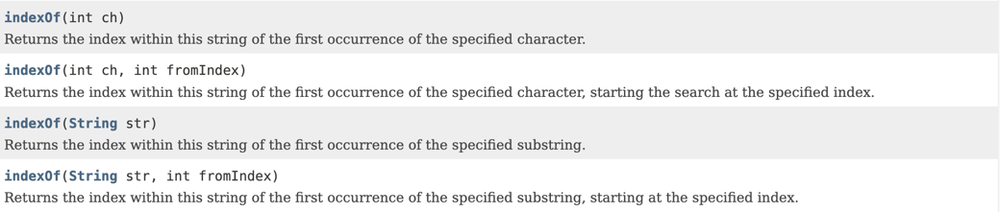

# Welcome!
If you're new to Git/GitHub, this is a README, and it's pretty self-explanatory. You read it. If anyone cares, these are typically written in Markdown, an open-source markup language that adds formatting to plaintext documents. [Here's the documentation if you want to learn more.](https://www.markdownguide.org/cheat-sheet/)

I'm gonna go ahead and say you'll get the most from this in an IDE. IntelliJ will probably be the easiest to set up out-of-the-box.

Lastly, this lab is intended to be a review. If any of the words Abstraction, Polymorphism, or Casting are new to you, close this page and figure those out first.
I'm not trying to be mean I just know this isn't good enough to teach it to you. 

Anyways... onto the lab. I was going to add the methods to the diagram, but I kept changing them so my bad.

***
## Abstraction and Abstract Classes
*The creation of well-defined classes and interfaces to hide well the complex inner workings from its users.*

### Abstract Classes
- `TODO: 1.1` In Main.java, try to declare a Bird, an Animal, and a Hummingbird.
- `TODO: 1.2` Try to instantiate the values created in the previous step. What happens?

### Abstract Methods
- `TODO: 2.1` Make the Animal.java class's an `makeNoise()` method abstract.
  - Ah! Some red squigglies have appeared! We must fix them!
  - `TODO: 2.2` Solution 1: Implement `makeNoise()` in the Bird class
    - Use this if you forgot what birds sound like `System.out.println("tweet tweet");`
    - Write some code to test what happens when we call makeNoise on both a Hummingbird and a Hawk.
    - Lastly, comment out your implementation to prepare for solution 2...
  - `TODO: 2.3` Solution 2: Implement `makeNoise()` in both the HummingBird and Hawk classes.
    - Make something up if you don't know what those sound like
    - Write some code to test what happens when we call makeNoise on both a Hummingbird and a Hawk.
    - Keep your code from this step or 2.2 before moving on.

***
## Polymorphism
*Having many forms*
### Compile-Time Polymorphism
*The one you know as Method Over**loading**. AKA Static Polymorphism or Static Binding*
> **Static polymorphism** *From: https://www.geeksforgeeks.org/polymorphism-in-java/*
> 
> Method Overloading: When there are multiple functions with the same name but different parameters then these functions are said to be overloaded. Functions can be overloaded by changes in the number of arguments, a change in the type of arguments, and/or a change in the order of arguments.

Example: The `indexOf()` method of Java's `String` class. 

- `TODO: 3.1` Overload the `killVermin()` method in Hawk.java to take in an `int` for the number of vermin to kill.
  - `TODO: 3.2` Call both implementations of `killVermin()` from Main.java

### Runtime Polymorphism
*The one you know as Method Over**riding**. AKA Dynamic Method Dispatch*

- `TODO: 4.1` In Main.java, instantiate a Hummingbird, then call it's `toString()` method and record the output
    - Which toString() will this call? Objects? Animals? Birds?
  - `TODO: 4.2` Override the `toString()` method in Hummingbird.java using the `super` keyword
    - Refer to Bird.java's toString() method if necessary.
  - `TODO: 4.3` Run your Main.java again and compare the output.
  - `TODO: 4.4` In Animal.java, add a super.toString() call to the output. What do you expect to happen when you run it again?
  - `TODO: 4.5` (Surprise!) Run your Main.java again and compare the output.

***
## Casting
*The utilization of polymorphism in code*

### Upcasting
*Always compiles, always runs*

`Person p1 = new Student()`

### Sidecasting
*Never compiles, thus never runs*

`Professor p1 = new Student()`

### DownCasting
*Always compiles, sometimes runs*
https://www.geeksforgeeks.org/rules-of-downcasting-objects-in-java/?ref=rp

`Student p1 = new Person()`

***
*Made for Elijah Nicpon's CS 1331 Exam 2 Double PLUS (Peer Led Undergraduate Study) Session*